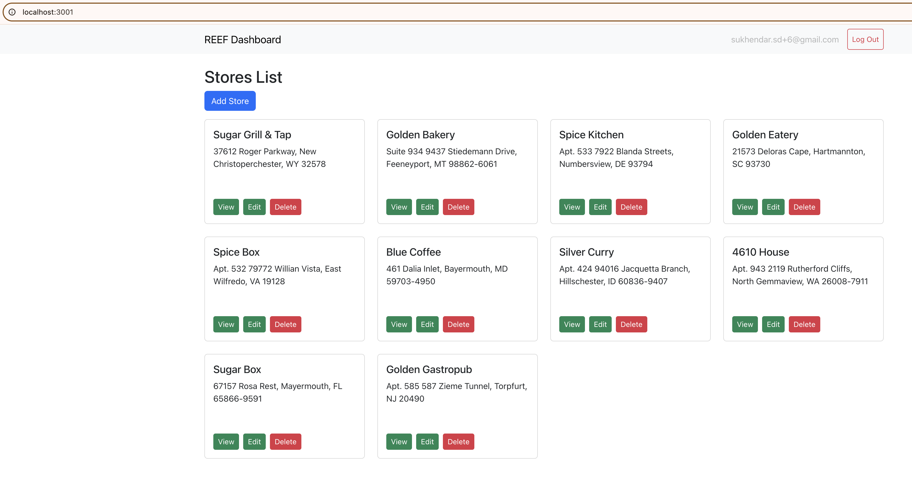
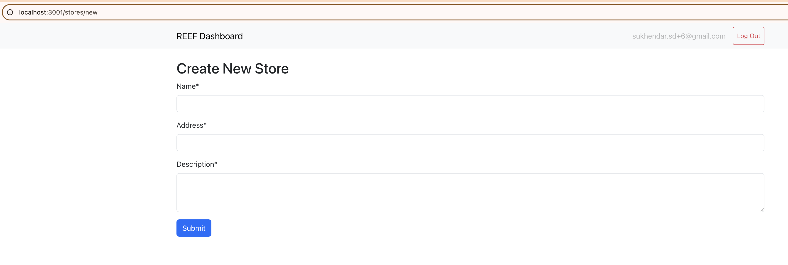
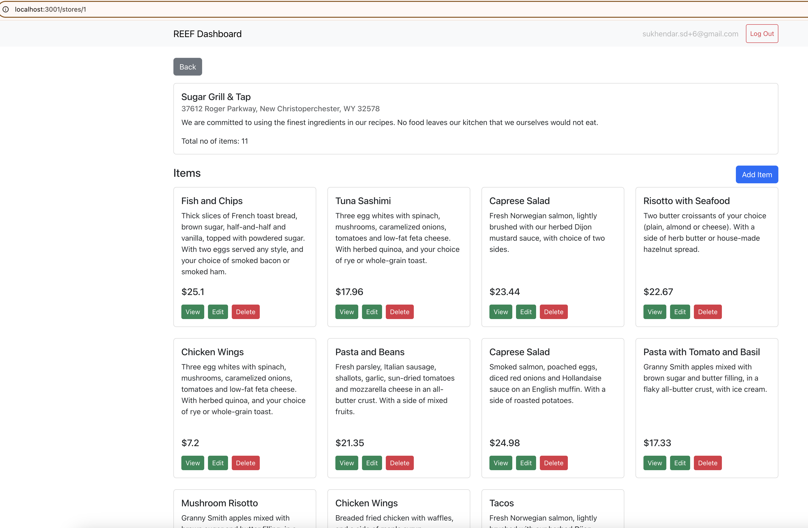
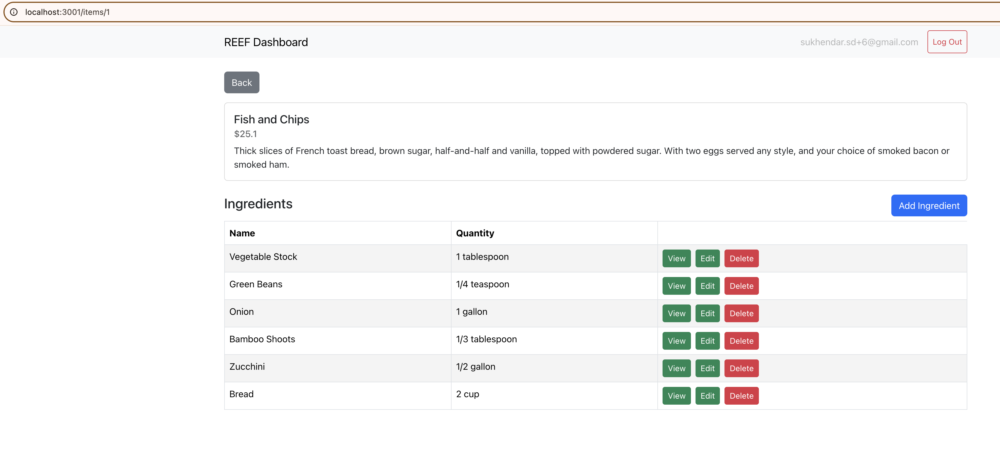
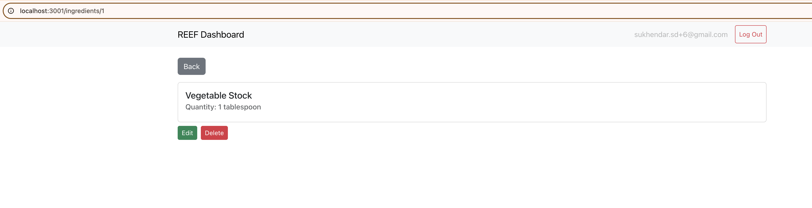
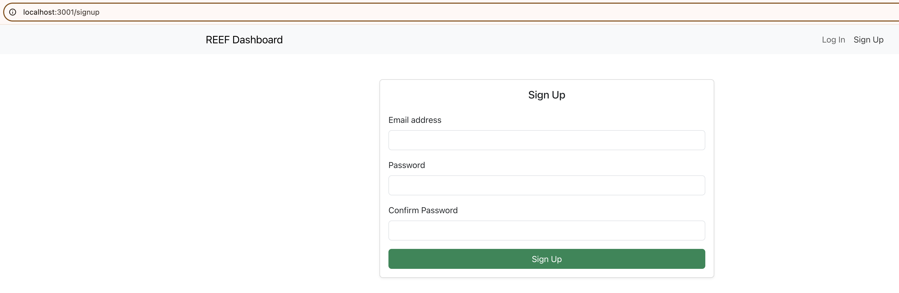
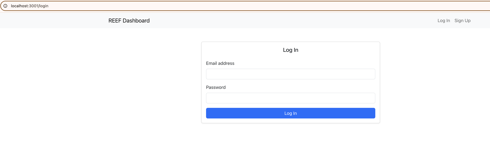

# React Store UI

This is the React frontend connects to the Rails API backend and allows users to manage stores, items, and ingredients with a user-friendly UI.

---

## Features

- React.js with functional components
- React Router for navigation
- Axios for API calls
- JWT-based authentication
- Bootstrap UI with client-side validations

---

## Docker Setup

this is handled by `docker-compose` inside `rails-store-api` repo. The service is auto-built and run on port `3001`.

### Manual setup:

```bash
git clone https://github.com/sukendhar/react-store-ui.git
cd react-store-ui
npm install
npm start
```

In `.env` add:

```bash
PORT=3001 # To run always on port 3001
```

Access React UI app at: [http://localhost:3001](http://localhost:3001)

---

## Pages and Views

- **Store List Page** – view all stores
- **Store View Page** – items within the store
- **Item View Page** – ingredients under each item
- **Add/Edit Forms** – for stores, items, and ingredients
- **Login / Signup** – JWT token stored in localStorage

---

### Screenshots







